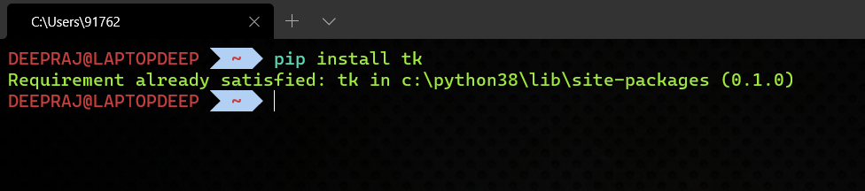
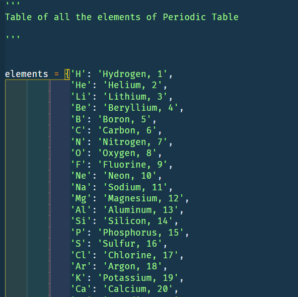
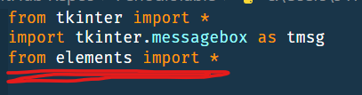
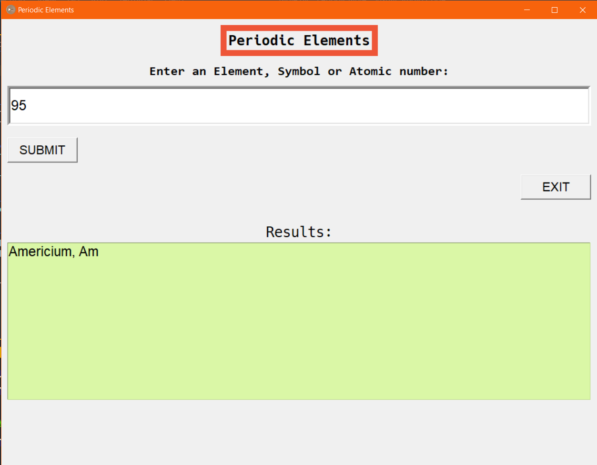

<<<<<<< HEAD
# Hi I am Deepraj Baidya😎, a Student DEV..

## Periodic Table Elements--GUI Version 🔥🔥🔥🔥🔥..

    - Hi, this is a "Periodic Table" GUI made using Tkinter module of Python..
    - This GUI takes User Input{of elements or symbols} and Returns the other Information of that element.
    
    ▶Hope You'll Like this one.🥰
    ▶Feel Free to contribute.....

### <u>Steps and Module Needed🤩🤩🤩.</u>
  
  1. We need to install Tkinter Library of Python in order to make the GUI
      - In order to install TKinter,first open your CMD or any other Terminal and type **{pip install tk}**. That's it.
        
  2. Now make a list of all the Elements of the Periodic Table in a seperate python file and store them all in a **dictionary**(a data type in python).
        

  3. Import the file containing the dictionary of all the     Elements in the main code file.
      - eg-- {from filename.py import *}, which in this case is [elements.py](elements.py)
        

  4. Now follow the code i.e-- [table.py](table.py)
 

## <u>Now Let's have a Look at the Final GUI....**😍😍😍**</u>

 

##### If You are unable to see the Image [Click Here](PeriodicGUI.png)
 

### <u>It's Looking Awesomeeeee😲, isn't it?</u>
 
 

# Here's All About Me..😎😎
 

## Personal Details..😁😁😁

  
:zap: Click Here to Know me😋

<!-- Little About Me-->
- 🌱 I’m currently learning everything 🤣
- 👯 I’m looking to collaborate with other Student Dev's
- 🥅 2021 Goals: Contribute more to Open Source projects
- ⚡ Fun fact: I love to play Football

 

## Contact Me...

    
:zap: Contact Details😄😃

My Github: [GitHub](https://github.com/deepraj02)
 
Instagram: [Instagram](https://www.instagram.com/deeprajbaidya02/?hl=en)
 
Website: [Hi,I am Deepraj](https://sites.google.com/view/deeprajbaidya)
 
Email: deeprajbaidya06@gmail.com

# HAPPY CODING....
 

## print("Merry Christmas to you All")

=======
# Hi I am Deepraj Baidya😎, a Student DEV..

## Periodic Table Elements--GUI Version 🔥🔥🔥🔥🔥..

    - Hi, this is a "Periodic Table" GUI made using Tkinter module of Python..
    - This GUI takes User Input{of elements or symbols} and Returns the other Information of that element.
    
    ▶Hope You'll Like this one.🥰
    ▶Feel Free to contribute.....

### <u>Steps and Module Needed🤩🤩🤩.</u>
  
  1. We need to install Tkinter Library of Python in order to make the GUI
      - In order to install TKinter,first open your CMD or any other Terminal and type **{pip install tk}**. That's it.
        
  2. Now make a list of all the Elements of the Periodic Table in a seperate python file and store them all in a **dictionary**(a data type in python).
        

  3. Import the file containing the dictionary of all the     Elements in the main code file.
      - eg-- {from filename.py import *}, which in this case is [elements.py](elements.py)
        

  4. Now follow the code i.e-- [table.py](table.py)
 

## <u>Now Let's have a Look at the Final GUI....**😍😍😍**</u>

 

##### If You are unable to see the Image [Click Here](PeriodicGUI.png)
 

### <u>It's Looking Awesomeeeee😲, isn't it?</u>
 
 

# Here's All About Me..😎😎
 

## Personal Details..😁😁😁

  
:zap: Click Here to Know me😋

<!-- Little About Me-->
- 🌱 I’m currently learning everything 🤣
- 👯 I’m looking to collaborate with other Student Dev's
- 🥅 2021 Goals: Contribute more to Open Source projects
- ⚡ Fun fact: I love to play Football

 

## Contact Me...

    
:zap: Contact Details😄😃

My Github: [GitHub](https://github.com/deepraj02)
 
Instagram: [Instagram](https://www.instagram.com/deeprajbaidya02/?hl=en)
 
Website: [Hi,I am Deepraj](https://sites.google.com/view/deeprajbaidya)
 
Email: deeprajbaidya06@gmail.com

# HAPPY CODING....
 

## print("Merry Christmas to you All")

>>>>>>> a48c6e21bb8304cb95fe4ffa013be39f5556ee82
